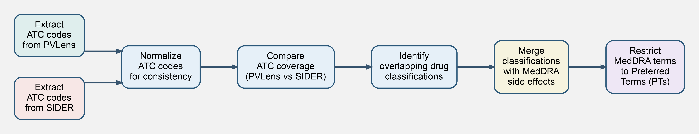

# AMIA2026

Materials associated with AMIA 2026 submissions by **Jeffery L.
Painter** and collaborators.

This repository contains the poster, code, and released data artifacts
supporting work on **interoperability between PVLens and SIDER**,
enabling PVLens-derived drug safety information to be expressed in the
standard SIDER data format.

------------------------------------------------------------------------

## Repository contents

-   **poster/** Poster PDF and figure source files for the PVLens--SIDER
    interoperability poster presented at AMIA 2026.

-   **pvlens_sider_update/** Code, documentation, and release materials
    for generating **SIDER-compatible replacement files** derived from
    PVLens data while preserving SIDER **STITCH/CID identifiers** for
    ATC-matched drugs.

------------------------------------------------------------------------

## Featured poster

**Enabling Interoperability Between PVLens and SIDER:\
A Pipeline for Generating SIDER-Compatible Drug--Adverse Event Data**

Poster PDF:\
`poster/Enabling_Interoperability_Between_PVLens_Painter.pdf`

------------------------------------------------------------------------

## Project overview

PVLens extracts drug safety information directly from **FDA Structured
Product Labeling (SPL)** documents using NLP and ontology-based mapping.

This repository provides a pipeline that:

1.  Extracts **adverse events and indications** from the PVLens
    database\
2.  Maps terms to **MedDRA concepts**\
3.  Matches PVLens drugs to **SIDER STITCH identifiers** using **ATC
    code overlap**\
4.  Generates **SIDER-compatible output files** that can replace the
    original SIDER tables for matched drugs

The resulting files maintain the original **SIDER drug identifiers**
while substituting PVLens-derived safety data.

## Pipeline overview



------------------------------------------------------------------------

## Download PVLens–SIDER replacement dataset

The fully generated PVLens-derived SIDER-compatible tables used in the AMIA 2026 poster are included in this repository.

Location:

```
pvlens_sider_update/release/files/
```


The release includes the following compressed TSV files:

- `meddra_all_label_indications.tsv.gz`
- `meddra_all_indications.tsv.gz`
- `meddra_all_label_se.tsv.gz`
- `meddra_all_se.tsv.gz`

These files are drop-in replacements for the corresponding **SIDER 4.1** tables for drugs that can be matched to PVLens via ATC codes.

Additional metadata files:

- `matched_flat_cids.csv` – SIDER STITCH flat identifiers matched to PVLens drugs
- `matched_atcs.csv` – ATC codes used for drug matching
- `sider_atcs.csv` – ATC codes extracted from SIDER

All files include **SHA-256 checksums** listed in:

```
pvlens_sider_update/release/files/checksums.txt
```

------------------------------------------------------------------------

## Citation

If you use these materials, please cite:

Anthony McDonald (Georgia State University, Undergraduate), Jeffery L. Painter.
Enabling Interoperability Between PVLens and SIDER:
A Pipeline for Generating SIDER-Compatible Drug–Adverse Event Data.
Submitted for consideration to the AMIA Annual Symposium 2026.


------------------------------------------------------------------------

## Related work: PVLens

This repository builds upon the PVLens pharmacovigilance framework, which extracts drug safety information from FDA Structured Product Labeling (SPL) documents using NLP and ontology-based mapping.

The PVLens project repository is available at:
https://github.com/GSK-Global-Safety/pvlens

If you use PVLens in your research, please cite:

Painter, J.L., Powell, G.E., & Bate, A. (2025).
PVLens: Enhancing pharmacovigilance through automated label extraction.
AMIA Annual Symposium Proceedings, 2025, Atlanta, GA.
DOI: 10.48550/arXiv.2503.20639

```bibtex
@article{pvlens2025,
  author       = {Painter, J.L. and Powell, G.E. and Bate, A.},
  title        = {{PVLens: Enhancing pharmacovigilance through automated label extraction}},
  journal      = {AMIA Annual Symposium Proceedings},
  publisher    = {AMIA},
  volume       = {2025},
  month        = {11},
  address      = {Atlanta, GA},
  type         = {Paper},
  doi          = {10.48550/arXiv.2503.20639}
}
```


